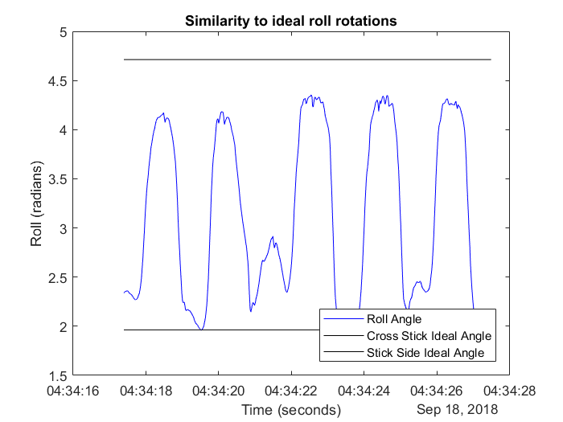

# Indian Dribble Assistant
## Improving Field Hockey Drills one Sensor at a Time
[](https://www.youtube.com/watch?v=J95l8xNy8fw)
# Diagram of Motion Model 
# Analysis
By breaking the Indian Dribble drill into four components: consistency, levelness, accuracy of rotations, and speed, we provide actionable feedback to users on improving their dribbling.  With feedback such as "your turn to cross stick is 20 degrees shallow" and "you tend to pull the ball at an angle, preventing your cross from being level", users can learn awareness of their weaknesses and improve upon them.  

## Consistency
Many field hockey players practice the indian dribble to improve their general stick skills.  Part of this is maintaining a consistent push and pull within the drill. Taking varying times to complete a cycle, indicates a lack of comfort with the push, pull or switch between the two.  This inconsistency can be seen visually by looking at the relative period sizes for each cycle.  If all periods are roughly the same size, the player was consistent; however, if the periods vary in size, the player should slow down and look at each component of their drill.   

Note in the graph below that the periodic motion has varying period lengths, indicating an inconsistent dribble.

*Insert metric

However, in this next image, the periods all look to be about the same length, meaning the dribble was fairly consistent.

*Insert metric

## Levelness
Another key aspect of the indian dribble is carrying the ball in a straight and level line during each cycle.  Based on our sensor placement, our measurement of the change in yaw shows how far one deviates from this straight line.  While some motion here is necessary to flip the stick, as seen in the sinusioidal shape of yaw's measurement over time, ideally movement in this direction should be minimized and the sinusoidal curve should be quite subtle.  In order to quantify this difference, we found the change in yaw by subtracting the peaks and valleys of the yaw measurements and projected the differences into a scale from ideal (10) to needing the most improvement (1).  

The small change in amplitude seen here represents a good, level drill. On our scale, this sample got a score of SCORE, reflecting our analysis of a level drill. 


*Insert score of yaw 1

The change in amplitude in this sample is larger and thus a less level drill. With a score of SCORE, this sample shows room for improvement. 


*Insert score of yaw bad

As shown by the graphs, the smaller change in the curve's amplitude, the better the score.

## Accurate Rotations
As seen in the indian dribble motion model, an ideal drill rotates the stick from a 90 degree angle with the club pointed away from the player to a 270 degree angle with the club facing the player.  By looking at the roll data of our stick's motion, we are able to determine how closely a player comes to achieving these desired angles.  We then quantify the player's distance from these ideal angles by projecting them onto scales from one to ten that represent the room for improvement from none necessary to lots of required practice. 


*Response 1


*Response 2

## Speed
Once a player is satisfied with the other components of their indian dribble, they can attempt to maximize their speed while not compromizing their sucess with the other components.  Maintaining a fast speed and consistency, levelness, and accurate rotations demonstrates mastry of the indian dribble drill.  To get an idea of how fast a player is doing the drill, we did some frequency analysis.  Because the motion is repetitive, it has a frequency. To get a better understanding of someone's frequency throughout the drill, we performed the Fast Fourier Transformation (FFT). The FFT transfered the data into the frequency domain, plotting against magnitude, allowing us to deduce the main frequency components. To find the characteristic frequency of the motion, we normalized the data, subtracting the frequency of the second highest peak, from the frequency of the highest peak (which centers near zero). This left us with the frequency at which the drill was completed. We then translated these frequencies to a scale of 1 to 10, to give users feedback on their speed.


*Insert metric


# Future Steps
If we were to continue pursuing this idea, the next step would be to work on making a user interface. Right now, one would have to load their data into matlab, and run the functions from there. In the future, we would love for field hockey players to be able to record the data on their phone, and get feedback, all in the same app.

# Source Code
```markdown
Syntax highlighted code block
```
[Link](url) and 

    
